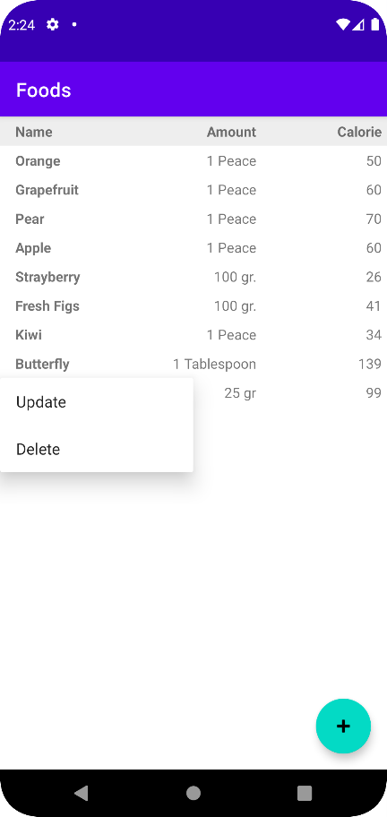
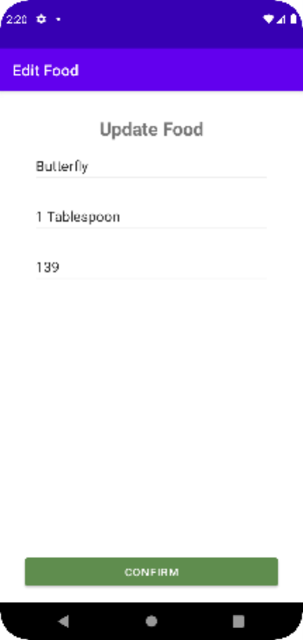

## Steps
    • Create SQLite Database
    • Create FoodProvider
    • Register FoodProvider inside Manifest file
    • Access your FoodProvider

 

## Used ones
    • ViewBinding
    • ContentProvider
    • RecyclerView
    • ActivityResultLauncher
    • SQLiteOpenHelper
    • PopupMenu

### ContentProvider
    • content://com.cenesiz.customcontentprovider.viewmodel/FoodProvider/FOODS
        • content                                       -> content provider prefix
        • com.cenesiz.customcontentprovider.viewmodel   -> content authority
        • FoodProvider                                  -> specific data
        • FOODS                                         -> database name


```groovy
<provider
        android:name=".viewmodel.FoodProvider"
        android:authorities="com.cenesiz.customcontentprovider.viewmodel"
        android:exported="true"
        android:grantUriPermissions="true"/>
```
